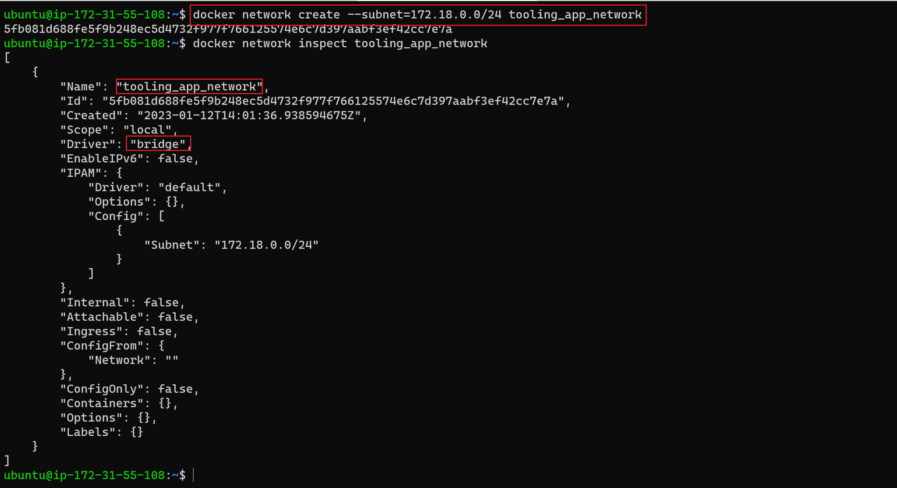

# MIGRATION TO THE СLOUD WITH CONTAINERIZATION

In this project, you will be deploying a simple PHP-based youb containerized solution backed by a MySQL database application using Docker.

[Docker](https://docs.docker.com/get-started/overview/) is an open source platform for shipping, developing and running application on any OS running a docker engine. It is fast, takes less space than VMs and can be distributed or shipped as a Docker image.

[A quick 2 minutes read about Docker Container, Docker Image & Dockerfile](https://dev.to/oayanda/getting-started-docker-container-docker-image-dockerfile-2oj9)

**Prerequiste**

- [Docker desktop](https://docs.docker.com/desktop/) is installed on your computer.
- Basic understanding of docker and containers.
- Basic Linux understanding will be helpful.

Let's Begin.

## MySQL in Container

Let us start assembling the application from the backend Database layer – you will use a pre-built MySQL database container, configure it, and make sure it is ready to receive requests from the frontend PHP application.

Step 1: Pull MySQL Docker Image from [Docker Hub Registry](https://hub.docker.com/)

In the termainal, 

```bash
# Search for the available MySql docker image in the docker hub registry
 
 docker search mysql-server
 ```

 

Next, you will pull the first on the list, which is the offical and latest version and stored in the docker build cache locally.

```bash
# Download docker image locally from docker hub
docker pull mysql/mysql-server:latest
```


You made this *pull* to make the container creation process faster. Otherwise, skip *step on*e and move to *step two*, which does the samething.

Step 2: Deploy the MySQL Container to your Docker Engine

Once you have the docker image, move on to deploy a new MySQL container

```bash
# Create a mysql container
docker run --name=mysqldb -e MYSQL_ROOT_PASSWORD=dontusethisinprod -d mysql/mysql-server:latest


# List all running containers
docker ps -a
```


## CONNECTING TO THE MYSQL DOCKER CONTAINER

Now, let's connect to the mysql container directly

_**First Method**_

```bash
# Connect to the mysql database and enter the from the initial step.

docker exec -it mysqldb mysql -uroot -p
```


You are going to use the second method below, so go ahead remove this container.

```bash
docker rm -f <your-container-name>
```

**_Second Method_**

After connecting to the MySql container, you could go on can configure the schema and prepare it for the Frontend PHP application but this means you will be using the default bridge network which is the defualt way for connection for all containers. However, it better to create our own private network which enable us to control the network cidr.

Let's go ahead and create a network

```bash
# Create a new bridge network

docker network create --subnet=172.15.10.0/24 tooling_app_network
```



This time, let us create an environment variable to store the root password:

```bash
# Save the password using environment variable
export MYSQL_PW=password

# verify the environment variable is created
echo $MYSQL_PW
```

> If you are using Window OS, run above command in your git bash terminal whicj comes with visual studio code editor.


To avoid name conflit, remember to remove the initial contianer as stated above.Now, pull the image and run the container, all in one command like this below

```bash
docker run --network tooling_app_network -h mysqlserverhost --name=mysql-server -e MYSQL_ROOT_PASSWORD=$MYSQL_PW  -d mysql/mysql-server:latest
```

_Flags used_

- -d runs the container in detached mode
- --network connects a container to a network
- -h specifies a hostname


It is best practice not to connect to the MySQL server remotely using the root user. Therefore, you will create a SQL script that will create a user you can use to connect remotely.

Create a file and name it ***create_user.sql*** and add the below code in the file

 ```bash
 CREATE USER '<username>'@'%' IDENTIFIED BY '<password>'; 
 GRANT ALL PRIVILEGES ON * . * TO '<username>'@'%';
 ```

 Replace the username and password to your values.


Now, run the script to create the new user. Enure you are in the directory ***create_user.sql*** file is located.  

```bash
docker exec -i mysql-server mysql -uroot -p$MYSQL_PW < create_user.sql
```


## Prepare Database Schema

Now, you need to prepare a database schema so that the Tooling application can connect to it.

1. Clone the Tooling-app repository from [here](https://github.com/oayanda/tooling-1)

```bash
git clone https://github.com/oayanda/tooling-1
```


You can find the schema in tooling PHP application repo.

```bash
ls ~/tooling-1/html/tooling_db_schema.sql
```


Use the SQL script to create the database and prepare the schema. With the ```docker exec``` command, you can execute a command in a running container.

```bash
docker exec -i mysql-server mysql -uroot -p$MYSQL_PW < ~/tooling-1/html/tooling_db_schema.sql
```


Update the .env file with connection details to the database