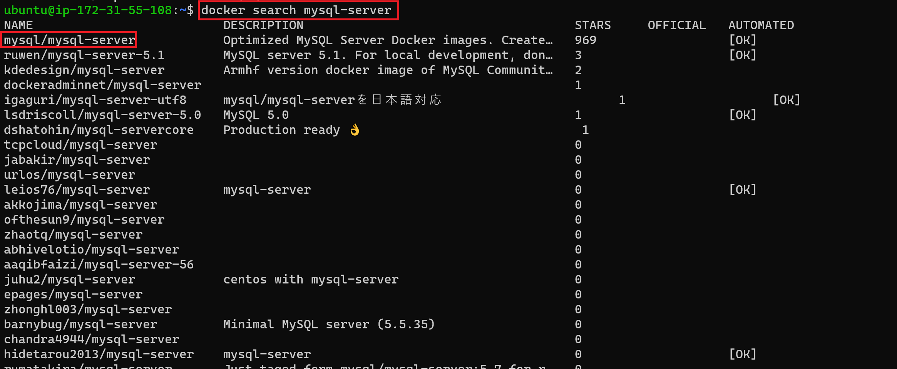

# MIGRATION TO THE СLOUD WITH CONTAINERIZATION

In this project, we will be deploying a simple PHP-based web containerized solution backed by a MySQL database application using Docker.

[Docker](https://docs.docker.com/get-started/overview/) is an open source platform for shipping, developing and running application on any OS running a docker engine. It is fast, takes less space than VMs and can be distributed or shipped as a Docker image.

[A quick 2 minutes read about Docker Container, Docker Image & Dockerfile](https://dev.to/oayanda/getting-started-docker-container-docker-image-dockerfile-2oj9)

**Prerequiste**

- You already have [docker desktop](https://docs.docker.com/desktop/) installed on your computer
- You have basic understanding of docker and containers
- Basic Linux understanding will be helpful

Let's Begin.

## MySQL in Container

Let us start assembling the application from the backend Database layer – we will use a pre-built MySQL database container, configure it, and make sure it is ready to receive requests from the frontend PHP application.

Step 1: Pull MySQL Docker Image from [Docker Hub Registry](https://hub.docker.com/)

- In the termainal, 

```bash
# search the available MySQl docker image in the docker hub registry
 
 docker search mysql
 ```

 

- We will use the first one on the list, which is the offical version.