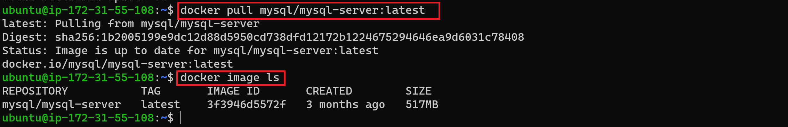
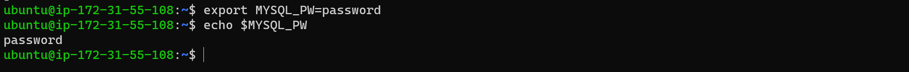
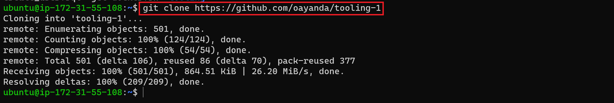
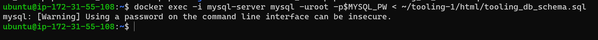
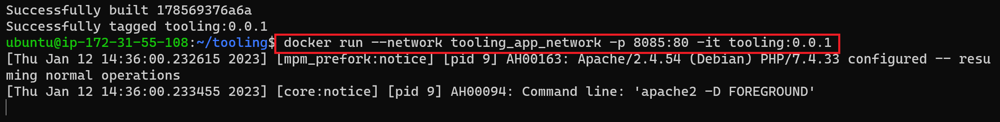

# MIGRATION TO THE СLOUD WITH CONTAINERIZATION

In this project, you will be deploying a simple PHP-based youb containerized solution backed by a MySQL database application using Docker.

[Docker](https://docs.docker.com/get-started/overview/) is an open source platform for shipping, developing and running application on any OS running a docker engine. It is fast, takes less space than VMs and can be distributed or shipped as a Docker image.

[A quick 2 minutes read about Docker Container, Docker Image & Dockerfile](https://dev.to/oayanda/getting-started-docker-container-docker-image-dockerfile-2oj9)

**Prerequiste**

- [Docker](https://docs.docker.com/engine/install/ubuntu/) is installed on your ubuntu instance .
- Basic understanding of docker and containers.
- Basic Linux understanding will be helpful.
- [AWS free tier here](https://aws.amazon.com/free/)

Let's Begin.

## MySQL in Container

Let us start assembling the application from the backend Database layer – we will use a pre-built MySQL database container, configure it, and make sure it is ready to receive requests from the frontend PHP application.

Step 1: Pull MySQL Docker Image from [Docker Hub Registry](https://hub.docker.com/)

In the termainal, 

```bash
# Search for the available MySql docker image in the docker hub registry
 
 docker search mysql-server
 ```

 

Next, we will pull the first on the list, which is the offical and latest version and stored in the docker build cache locally.

```bash
# Download docker image locally from docker hub
docker pull mysql/mysql-server:latest
```



You made this *pull* to make the container creation process faster. Otherwise, skip *step on*e and move to *step two*, which does the samething.

Step 2: Deploy the MySQL Container to your Docker Engine

Once we have the docker image, move on to deploy a new MySQL container

```bash
# Create a mysql container
docker run --name=mysqldb -e MYSQL_ROOT_PASSWORD=dontusethisinprod -d mysql/mysql-server:latest


# List all running containers
docker ps -a
```


## Connecting to MYSQL Docker Container

Now, let's connect to the mysql container directly

_**First Method**_

```bash
# Connect to the mysql database and enter the from the initial step.

docker exec -it mysqldb mysql -uroot -p

# Exit the mysql mode
exit
```


You are going to use the second method below, so go ahead remove this container.

```bash
docker rm -f mysqldb
```

**_Second Method_**

After connecting to the MySql container, we could go on can configure the schema and prepare it for the Frontend PHP application but this means we will be using the default bridge network which is the defualt way for connection for all containers. However, it better to create our own private network which enable us to control the network cidr.

Let's go ahead and create a network

```bash
# Create a new bridge network

docker network create --subnet=172.18.0.0/24 tooling_app_network
```


This time, let us create an environment variable to store the root password:

```bash
# Save the password using environment variable
export MYSQL_PW=password

# verify the environment variable is created
echo $MYSQL_PW
```

> If you are using Window OS, run above command in your git bash terminal which comes with visual studio code editor.



To avoid name conflit, remember to remove the initial contianer as stated above.Now, pull the image and run the container, all in one command like this below

```bash
docker run --network tooling_app_network -h mysqlserverhost --name=mysql-server -e MYSQL_ROOT_PASSWORD=$MYSQL_PW  -d mysql/mysql-server:latest
```

_Flags used_

- -d runs the container in detached mode
- --network connects a container to a network
- -h specifies a hostname


It is best practice not to connect to the MySQL server remotely using the root user. Therefore, we will create a SQL script that will create a user we can use to connect remotely.

Create a file and name it ***create_user.sql*** and add the below code in the file

 ```bash
 CREATE USER '<username>'@'%' IDENTIFIED BY '<password>'; 
 GRANT ALL PRIVILEGES ON * . * TO '<username>'@'%';
 ```

 Replace the username and password to your values.


Now, run the script to create the new user. Ensure you are in the directory ***create_user.sql*** file is located.  

```bash
docker exec -i mysql-server mysql -uroot -p$MYSQL_PW < create_user.sql
```


## Prepare Database Schema

Now, you need to prepare a database schema so that the Tooling application can connect to it.

Clone the Tooling-app repository from [here](https://github.com/oayanda/tooling-1)

```bash
git clone https://github.com/oayanda/tooling-1
```



You can find the schema in tooling PHP application repo.

```bash
ls ~/tooling-1/html/
```


Use the SQL script to create the database and prepare the schema. With the ```docker exec``` command, you can execute a command in a running container.

```bash
docker exec -i mysql-server mysql -uroot -p$MYSQL_PW < ~/tooling-1/html/tooling_db_schema.sql
```



Next, you need to update the ```.env``` file with connection details to the database
The `.env` file is located in the html ```~/tooling/html/```

```bash
# View the location of the file
ls la ~/tooling/html/
```


Let's update the connection to the database using the `vi` editor

```bash
vi ~/tooling-1/html/.env
```


***Flags used:***

- MYSQL_IP mysql ip address "leave as mysqlserverhost"
- MYSQL_USER mysql username for user export as environment variable
- MYSQL_PASS mysql password for the user exported as environment varaible
- MYSQL_DBNAME mysql databse name "toolingdb"

Update the `servername`, `username`, `password`& `databasename` in `db_conn.php` file in `tooling/html` directory


Run the Tooling App

You are almost there. Now you need to containerized the Frontend Application as well and then connect it to the Mysql database.

However, as you now know that you need a Dock image to create a `Container` but you need a `Dockerfile` to create a `Docker image`. In the cloned tooling application repo you now have on system is a Dockerfile which you going to used to build the docker image.

> Ensure you are inside the directory "tooling" that has the file Dockerfile and build your container.

```bash 
docker build -t tooling:0.0.1 .
```

In the above command, we specify a parameter `-t`, so that the image can be tagged "`tooling.0.1`" - Also, you have to notice the `.` at the end. This is important as that tells Docker to locate the `Dockerfile` in the current directory you are running the command. Otherwise, you would need to specify the absolute path to the `Dockerfile`


Run the container

```bash
docker run --network tooling_app_network -p 8085:80 -it tooling:0.0.1 
```



Ensure to allow port 8085 for a TCP connection in your secuirty group.


View the login page in browser


The default email is test@gmail.com, the password is 12345


## ADDITIONAL TASK

Write a Dockerfile for the TODO app
View Dockerfile Here
Update the .env file with database connection details

Run both database and app on your laptop Docker Engine


Access the application from the browser


**Part 2**

Create an account in Docker Hub

After creating an account on `docker hub`, come to your terminal and enter `docker login` followed the prompt and enter your `username` and `password`.


Create the docker image
In the application directory, create your docker image

```bash
docker build . -t oayanda/laravel-todo:0.0..1
```


Next, push the docker images from your PC to your docker repository

```bash
docker push oayanda/laravel_todo:0.0.1
```


Verify in docker hub


CI/CD  docker Image

Write a Jenkinsfile that will simulate a Docker Build and a Docker Push to the registry

```bash
pipeline {
    agent any 
    environment {
    DOCKERHUB_CREDENTIALS = credentials('oayanda-dockerhub')
    }
    stages { 
        stage("Initial cleanup") {
			steps {
				dir("${WORKSPACE}") {
					deleteDir()
				}
			}
		}
        stage('SCM Checkout') {
            steps{
            git branch: 'main', url: 'https://github.com/oayanda/Todo_App.git'
            }
        }

        stage('Build docker image') {
            steps {  
                sh 'docker build -t oayanda/todo:$GIT_BRANCH-0.0.$BUILD_NUMBER .'
            }
        }
        stage('login to dockerhub') {
            steps{
                sh 'echo $DOCKERHUB_CREDENTIALS_PSW | docker login -u $DOCKERHUB_CREDENTIALS_USR --password-stdin'
            }
        }
        stage('push image') {
            steps{
                sh 'docker push oayanda/todo:$GIT_BRANCH-0.0.$BUILD_NUMBER'
            }
        }
       stage('Cleanup') {
			steps {
				cleanWs(cleanWhenAborted: true, cleanWhenFailure: true, cleanWhenNotBuilt: true, cleanWhenUnstable: true, deleteDirs: true)
				
				sh 'docker logout'

				
			}
		}
    }

}
```
Connect your repo to Jenkins

Add a webhook to github repo

- Click on `Setting` and select `Webhooks`, click on `Add webhook` and add the `<jekins URL>/github-webhook/`
- Content type: `application/json` and select j`ust the push event` and active.


Create a multi-branch pipeline

- Install Blue Ocean plugin and Open it dashboard
- Add your Docker login credentials in `Manage Credentials` in  Jenkins
- Select create `New pipeline`
- Select `Github` and your `Github account`
- Select the repo for the pipeline
- Select `create pipeline`


Jenkins automatially picks the Jenkinsfile in the repo and runs the multi pipeline.


Create additional feature and verify that the images pushed from the CI can be found at the registry.


Deployment Tooling Application with Docker Compose

Create a tooling.yml file

```bash
version: "3.9"
services:
  tooling_frontend:
    build: .
    ports:
      - "5000:80"
    volumes:
      - tooling_frontend:/var/www/html
    links:
      - db
  db:
    image: mysql:5.7
    restart: always
    environment:
      MYSQL_DATABASE: <The database name required by Tooling app >
      MYSQL_USER: <The user required by Tooling app >
      MYSQL_PASSWORD: <The password required by Tooling app >
      MYSQL_RANDOM_ROOT_PASSWORD: '1'
    volumes:
      - db:/var/lib/mysql
volumes:
  tooling_frontend:
  db:
  ```

```bash
# Run docker compose file
docker compose -f tooling.yaml  up -d 
```

  

 Tags n the Compose file tooling.yaml

- `Services`: Computing components of an application and communicate with each other through Networks.
- `Links` defines a network link to containers in another service. Either specify both the service name and a link alias (SERVICE:ALIAS), or just the service name.
- `Volumes`: section allows the configuration of named volumes that can be reused across multiple services.


Update your Jenkinsfile with a test stage before pushing the image to the registry.

  