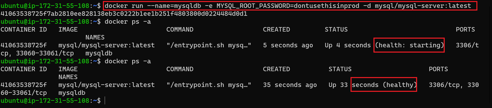

# MIGRATION TO THE СLOUD WITH CONTAINERIZATION

In this project, we will be deploying a simple PHP-based web containerized solution backed by a MySQL database application using Docker.

[Docker](https://docs.docker.com/get-started/overview/) is an open source platform for shipping, developing and running application on any OS running a docker engine. It is fast, takes less space than VMs and can be distributed or shipped as a Docker image.

[A quick 2 minutes read about Docker Container, Docker Image & Dockerfile](https://dev.to/oayanda/getting-started-docker-container-docker-image-dockerfile-2oj9)

**Prerequiste**

- [Docker desktop](https://docs.docker.com/desktop/) is installed on your computer.
- Basic understanding of docker and containers.
- Basic Linux understanding will be helpful.

Let's Begin.

## MySQL in Container

Let us start assembling the application from the backend Database layer – we will use a pre-built MySQL database container, configure it, and make sure it is ready to receive requests from the frontend PHP application.

Step 1: Pull MySQL Docker Image from [Docker Hub Registry](https://hub.docker.com/)

In the termainal, 

```bash
# Search for the available MySql docker image in the docker hub registry
 
 docker search mysql
 ```

 

Next, we will pull the first on the list, which is the offical and latest version and stored in the docker build cache locally.

```bash
# Download docker image locally from docker hub
docker pull mysql
```


We made this *pull* to make our container creation process faster. Otherwise, skip *step on*e and move to *step two*, which does the samething.

Step 2: Deploy the MySQL Container to your Docker Engine

Once you have the docker image, move on to deploy a new MySQL container

```bash
# Create a mysql container
docker run --name=mysqldb -e MYSQL_ROOT_PASSWORD=dontusethisinprod -d mysql

# List all running containers
docker ps -a
```

